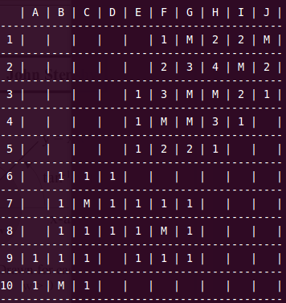
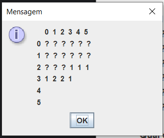
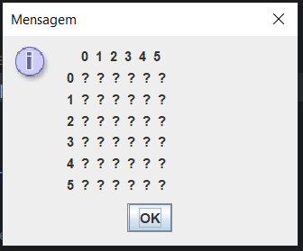
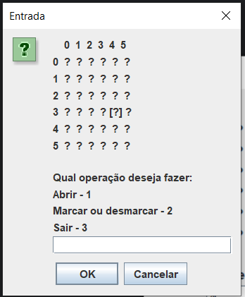

# primeiro-projeto-campo-minado-java

<h2>Esse projeto foi feito inicialmente para ser  execultado no terminal,
mas eu o adaptei  para janela usando o JOptionPane</h2>

<h3>demonstração de como deve ficar:</h3>

 
crédito para : https://wiki.sj.ifsc.edu.br/index.php/SOP-2010-2-tiago

<h3>o resultado foi: </h3>

<h3>Aqui está uma demonstração do projeto</h3>

